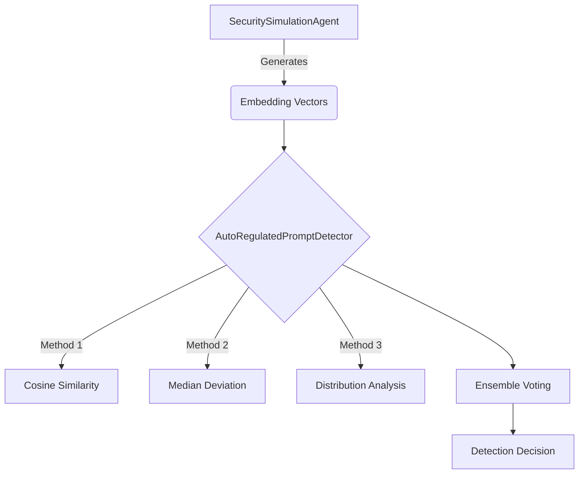

<!-- SPDX-License-Identifier: MPL-2.0 -->
# WildCore: Advanced AI Security & Anomaly Detection Framework

[](https://github.com/ochoaughini/WildCore/actions/workflows/ci.yml)
[](LICENSE)
[](https://www.python.org/downloads/)

WildCore is an open-source framework for simulating, detecting, and analysing
vulnerabilities in embedding-based Artificial Intelligence systems. It provides
reproducible tooling for modelling containment breaches, stress testing
anomaly-detection heuristics, and validating defences against prompt-injection
and vector-poisoning attacks.

---

## Table of Contents
- [Key Features](#key-features)
- [Architecture](#architecture)
- [Getting Started](#getting-started)
- [Developer Tasks](#developer-tasks)
- [Project Layout](#project-layout)
- [Documentation](#documentation)
- [Contributing](#contributing)
- [License](#license)
- [Credits](#credits)

## Credits
See [NOTICE](NOTICE) for project ownership details and third-party attributions.

## Key Features
- **Simulation Agent (`SecuritySimulationAgent`)** – configurable behaviours for
  both benign and malicious roles to benchmark containment strategies.
- **Auto-Regulated Detector (`AutoRegulatedPromptDetector`)** – ensemble
  detection using cosine similarity, adaptive thresholds, and distribution
  analysis.
- **Deterministic evaluation harness** – reproducible simulation pipeline with
  seeded randomness for predictable CI runs.
- **Unified tooling** – consistent scripts and Make targets mirror the CI
  pipeline, ensuring local verification matches remote automation.

## Architecture


## Getting Started
### Prerequisites
- Python 3.10+ (managed via [asdf](https://asdf-vm.com/) or
  [mise](https://mise.jdx.dev/)).
- GNU Make
- Git

### Bootstrap the environment
```bash
make bootstrap
```
This creates `.venv`, installs the project in editable mode with all
instrumentation tools, and configures git hooks via `pre-commit`.

### Run the simulation demo
```bash
source .venv/bin/activate
python -m wildcore --iterations 12 --threshold 0.55
```
The command prints a JSON summary of the simulated attack and detection cycle.

### Execute the full verification suite
```bash
make check
```
This mirrors the CI workflow (linting, formatting checks, static analysis,
security scanning, and tests with coverage).

## Developer Tasks
Every task is available as both a script under `scripts/` and a corresponding
Make target. Commands accept `--help`/`--fix` where relevant and are safe to run
non-interactively.

| Task | Script | Make Target | Description |
| ---- | ------ | ----------- | ----------- |
| Bootstrap | `scripts/bootstrap` | `make bootstrap` | Create/update the virtual environment, install dev dependencies, and configure git hooks. |
| Developer demo | `scripts/dev` | `make dev` | Run the WildCore CLI simulation locally. |
| Lint | `scripts/lint [--fix]` | `make lint` | Ruff linting plus optional auto-fixes, Black/isort conformance. |
| Format | `scripts/fmt [--check]` | `make fmt` | Apply or verify formatting across Python, docs, and scripts. |
| Type check | `scripts/typecheck` | `make typecheck` | Run mypy in strict mode against `src/` and `tests/`. |
| Tests | `scripts/test` | `make test` | Execute unit and integration test suites. |
| End-to-end | `scripts/e2e` | `make e2e` | Run E2E scenarios when present. |
| Coverage | `scripts/coverage` | `make coverage` | Generate coverage reports (terminal + XML). |
| Build | `scripts/build` | `make build` | Produce source and wheel distributions via `python -m build`. |
| Package | `scripts/package` | `make package` | Alias for `scripts/build` to create distributable artefacts. |
| Release | `scripts/release` | `make release` | Build artefacts, run `twine check`, and prepare for publishing (requires `VERSION_TAG`). |
| Update dependencies | `scripts/update-deps` | `make update-deps` | Compile and sync pinned dependencies with `pip-tools`. |
| Security scan | `scripts/security-scan` | `make security-scan` | Run `pip-audit`, `bandit`, and `detect-secrets`. |
| SBOM | `scripts/sbom` | `make sbom` | Generate a CycloneDX SBOM at `sbom/wildcore-sbom.json`. |
| Docs | `scripts/gen-docs` | `make gen-docs` | Build developer documentation using MkDocs. |
| Migrations | `scripts/migrate` | `make migrate` | Run database migrations (no-op unless Alembic is configured). |
| Clean | `scripts/clean` | `make clean` | Remove build artefacts and caches. |
| Check | `scripts/check` | `make check` | Run lint, format check, type check, tests, coverage, and security scanning. |

## Project Layout
```
.
├── assets/                 # Static design assets (placeholders tracked via .gitkeep)
├── ci/                     # CI artefacts, reports, and configuration glue
├── configs/                # Service / application configuration manifests
├── data/                   # Sample datasets (non-sensitive, checked in)
├── docs/
│   ├── adr/                # Architectural decision records
│   └── ...
├── infra/
│   └── docker/             # Container definitions and runtime configuration
├── scripts/                # Unified developer toolbelt (mirrored by Makefile)
├── src/
│   └── wildcore/           # Python source package (see `__main__.py` for CLI)
├── tests/
│   ├── fixtures/           # Shared deterministic fixtures
│   ├── unit/               # Unit tests mirroring source layout
│   ├── integration/        # Cross-module integration tests
│   └── e2e/                # Behaviour-driven end-to-end tests
├── CHANGELOG.md
├── CODE_OF_CONDUCT.md
├── CONTRIBUTING.md
├── LICENSE
├── Makefile
├── project.yaml
└── ...
```

## Documentation
Developer documentation is built with MkDocs. Generate the static site with:
```bash
make gen-docs
```
Additional architectural decisions live under `docs/adr/`.

## Contributing
We welcome contributions! Please see [CONTRIBUTING.md](CONTRIBUTING.md) for
coding standards, review expectations, and the required code of conduct.

## License
WildCore is licensed under the [Mozilla Public License 2.0](LICENSE). The MPL
ensures that any modifications to MPL-covered files are shared under the same
terms while allowing larger aggregates to remain proprietary. Distribution
packages must include both the [LICENSE](LICENSE) file and the
[NOTICE](NOTICE) file.
